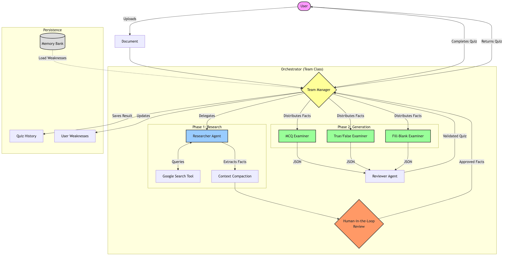

### Problem Statement
Studying complex technical documents is often a passive and inefficient process. Learners struggle to identify key concepts, test their understanding, and track their progress over time. Manually creating practice quizzes is time-consuming and requires a deep understanding of the material that the learner might not yet possess. Furthermore, generic study tools lack the context of the specific documents a user needs to master, leading to irrelevant questions and wasted study time.

### Solution Statement
Agents are the ideal solution because they can dynamically adapt to any content. Unlike static rule-based systems, an agentic architecture can "read" a document, "research" missing context, and "reason" about what makes a good question. By using specialized agents for different tasks—researching, generating questions, and reviewing quality—a team of expert tutors is simulated working in parallel to create a personalized study experience that scales instantly to any topic.

### Architecture

Core to **Auto Study** is the `Team` class — a prime example of a **Multi-agent system**. It is not a monolithic application but an ecosystem of specialized agents, each contributing to a different stage of the study material creation process. This modular approach, facilitated by the **Google Agent Development Kit (ADK)**, allows for a sophisticated and robust workflow. The central orchestrator of this system is the `Team` class in `server/agent.js`.

The `Team` orchestrates a pipeline of specialized sub-agents:

*   **Researcher Agent**: This agent is responsible for the initial "Research" phase. It is an `LlmAgent` equipped with a **Custom tool** (`google_search`) that allows it to fetch external definitions when the source document is insufficient. It distills the raw document into a concise set of facts (**Context compaction**).
*   **Examiner Agents (Parallel)**: Once facts are established, the system spins up three specialized **Parallel agents** (`MCQ_Examiner`, `TF_Examiner`, `Blank_Examiner`). Each is an expert in generating a specific question type, running concurrently to maximize efficiency.
*   **Reviewer Agent**: This agent acts as a quality gate, evaluating the output of the Researcher before it flows downstream.

### Key Features
**Auto Study** transforms static documents into interactive quizzes using this agentic architecture.

*   **Sequential & Parallel Agents**: The workflow combines **Sequential agents** (Researcher -> Reviewer) to establish facts, followed by **Parallel agents** (three specialized Examiners) running concurrently to generate diverse question types (MCQ, True/False, Fill-in-the-Blank) efficiently.
*   **Agent powered by an LLM**: Each agent is powered by **Vertex AI (Gemini 2.5 Flash)**, utilizing its long-context window to process extensive documentation.
*   **Tools**: The Researcher agent is equipped with **Custom tools**, specifically a `google_search` tool defined via `FunctionTool`, allowing it to fetch external definitions when the source document is insufficient.
*   **Sessions & Memory**:
    *   **Sessions & state management**: The system uses `InMemorySessionService` to manage the immediate context of the research session.
    *   **Long term memory**: A **Memory Bank** (`server/memory.js`) persists user state, specifically tracking "Weaknesses" and "Topics Studied" across sessions to personalize future interactions.
*   **Long-running operations**: The architecture supports **pausing and resuming** the workflow. The process halts after the Research phase for a **Human-in-the-Loop** review, effectively pausing the agentic operation until the user approves the extracted facts.
*   **Observability**: The system includes real-time **Logging** of agent thoughts and tool executions, streamed directly to the client UI to provide transparency into the agent's reasoning process.

### The Build
The application is built using **Node.js** and **Express** for the backend, with the **Google ADK** providing the framework for agent definition and orchestration.

*   **Context Engineering**: Context is optimized by splitting the workflow. Instead of feeding the entire document to every agent, the Researcher distills it into a concise list of facts (**Context compaction**), which is then passed to the Examiners, reducing noise and improving generation quality.
*   **Agent Evaluation**: The `Reviewer` agent serves as an in-stream evaluation step, checking the output of the Researcher before it moves downstream.

### Future Enhancements
*   **Loop Agents**: Fully implementing **Loop agents** for the Examiners would allow them to self-correct if their generated questions fail validation checks (e.g., missing options or incorrect JSON format).
*   **Agent Deployment**: Containerizing the agent service for scalable **Agent deployment** on Cloud Run would allow the parallel agents to scale independently based on load.
*   **A2A Protocol**: Implementing a formal **A2A (Agent-to-Agent) Protocol** would standardize the communication between the Researcher and Examiners, decoupling them further.
*   **MCP Integration**: Integrating **Model Context Protocol (MCP)** servers would allow the agents to directly access user data repositories (like Google Drive or Notion) as additional knowledge sources.
